# Description du script
1- Il s'agit d'une implémentation Python de l'outil de ligne de commande Traceroute, qui est utilisé pour tracer le chemin que prend un paquet d'une source à une destination sur un réseau. Cette implémentation utilise les bibliothèques Scapy et NetworkX pour envoyer des paquets et générer un graphique respectivement.

2- Le programme envoie des paquets avec des valeurs TTL (Time To Live) croissantes jusqu'à ce qu'ils atteignent la destination ou que le nombre maximum de sauts soit dépassé.

3- le script prend la destination de stdout ou d'un fichier "csv ou txt".

4- Il peut également générer un fichier de sortie et un graphique de réseau de la trace.

# Prérequis
- python 3.x
- scapy
- networkX
- matplotlib
- pillow
**installation des prérequis**
tous les prérequis des scripts se trouvent dans le fichier requirements.txt pour les installer sous windows ou linux lancez la commande suivante. 
```
pip install -r requirements.txt
```

# utilisation
```
usage: traceroute.py [-h] [-m MAX_HOPS] [-t TIMEOUT] [-q QUERIES] [-n]
                     [-P PROTOCOL] [-p PORT] [-o] [-l PAYLOAD] [-T] [-U] [-I]
                     [-6] [-g]
                     file

Traceroute implementation with options.

positional arguments:
  file                  Path to the file containing the IP addresses

options:
  -h, --help            show this help message and exit
  -m MAX_HOPS, -M MAX_HOPS, --max-hops MAX_HOPS
                        Maximum number of hops to reach the destination.
                        Default is 30
  -t TIMEOUT, --timeout TIMEOUT
                        Time to wait for a response in seconds. Default is 2
  -q QUERIES, --queries QUERIES
                        Number of probes to send to each hop. Default is 3
  -n, --dns             no dns resolution
  -P PROTOCOL, --protocol PROTOCOL
                        Protocol to use (UDP, TCP, ICMP). Default is UDP
  -p PORT, --port PORT  Destination port. Default is 33434
  -o, --output          Write output to file instead of console. Default is
                        False
  -l PAYLOAD, --payload PAYLOAD
                        Payload length of the packets sent. Default is 60
  -T, --tcp             use tcp protocol
  -U, --udp             use udp protocol
  -I, --icmp            use icmp protocol
  -6, --ipv6            traceroute for ip v6
  -g, -G, --graph       Generate a graph showing the path taken by the
                        packets. Default is False
```


# Examples:
**1.** en utilisant le script pour faire un traceroute vers google dns 8.8.8.8, aussi générer un graphe et un txt de sortie
a. output
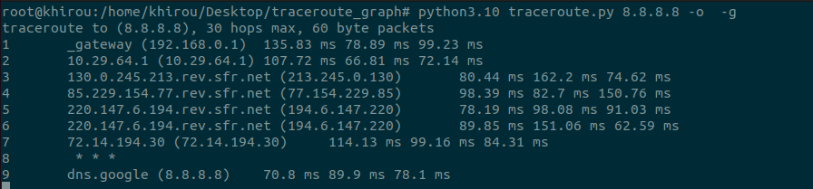
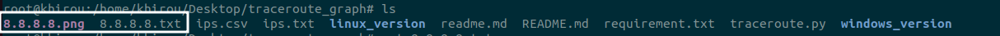

b. graph
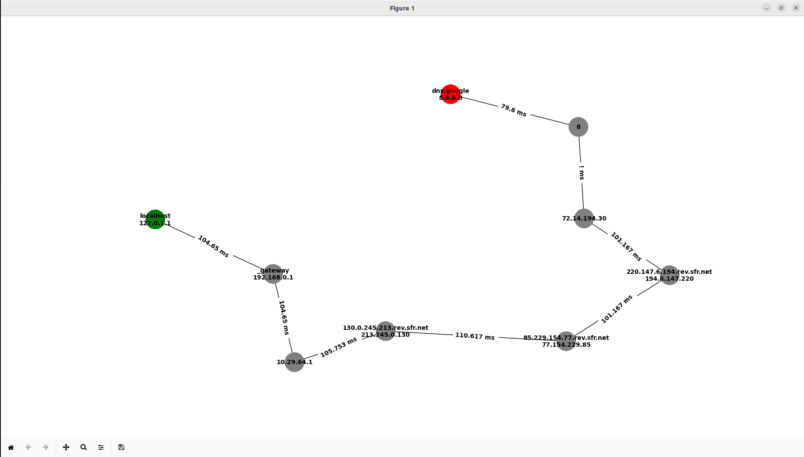

c. output image
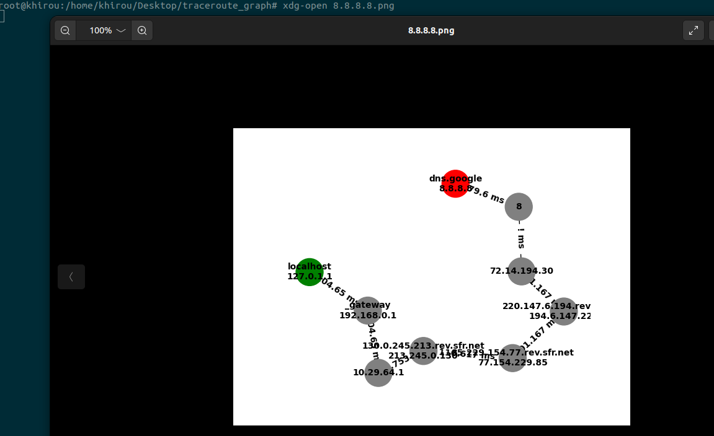

d. output fichier
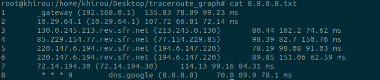

**2** en utilisant le script pour faire un traceroute vers group des host a partir d'un fichier
a. output
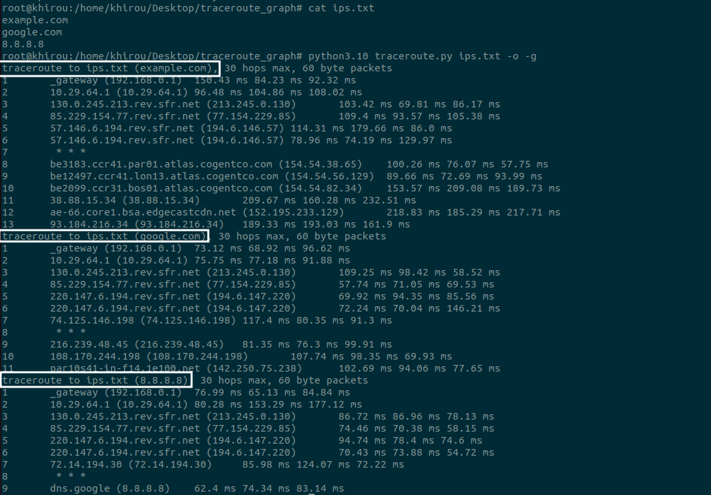

b. 
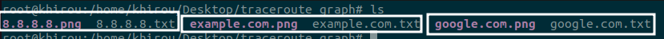

**3** l'utilisation de protocol tcp avec changement de port de destination
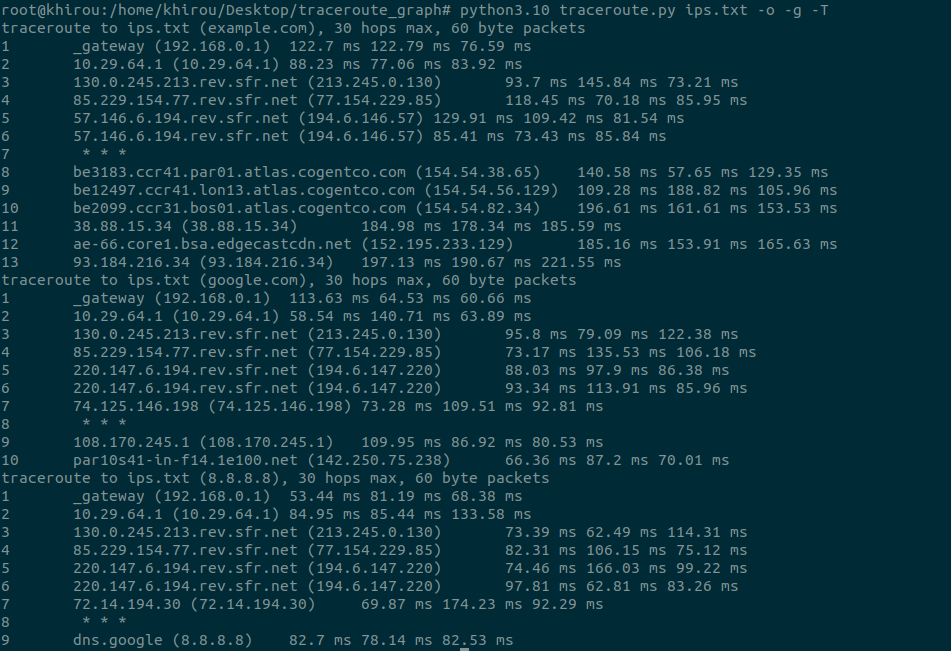

**4** l'utilisation de protocol icmp
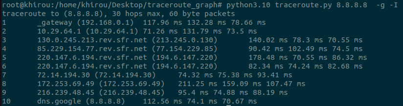

**5**  désactiver la résolution dns 
a. output
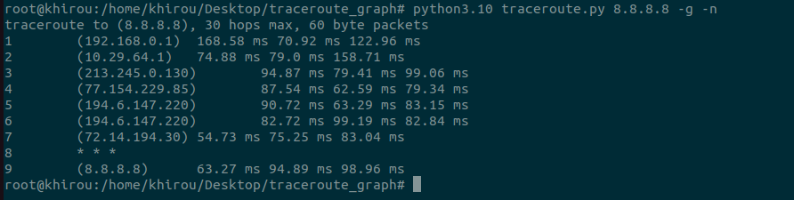

b. graph
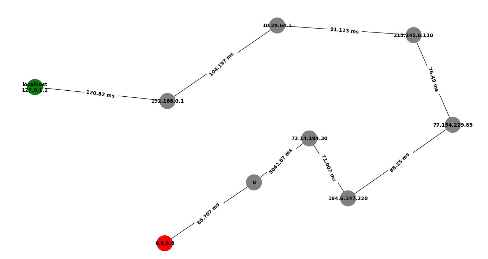

**6** modifier la longueur du paquet
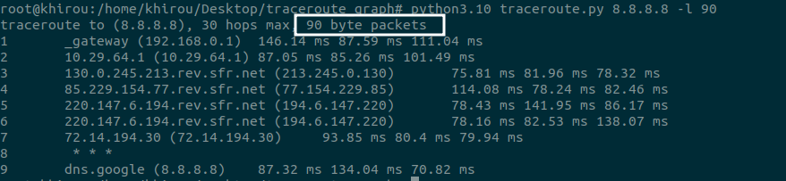

# la structure de  code
**A. imports**
```
import socket
import struct
import time
import argparse 
import os 
import csv
import ipaddress
from scapy.all import *
import random
import networkx as nx
import matplotlib.pyplot as plt
```
-   La bibliothèque socket: fournit des méthodes pour la communication réseau basée sur les sockets.  
-   La bibliothèque struct: La bibliothèque struct permet la conversion de données binaires en types de données Python et vice versa.
-   La bibliothèque time: fournit des fonctions pour travailler avec le temps.
-   La bibliothèque argparse: fournit une façon de définir des arguments en ligne de commande.
-   La bibliothèque os: fournit des fonctions pour interagir avec le système d'exploitation. import csv
-   La bibliothèque csv: fournit des fonctions pour lire et écrire des fichiers CSV.
-   La bibliothèque ipaddress: fournit des classes pour travailler avec les adresses IP. 
-   Scapy: est un module Python qui permet de créer, de modifier, de capturer et d'envoyer des paquets réseau.
-   NetworkX: est un module Python qui fournit des outils pour travailler avec des graphes et des réseaux. 
-   Matplotlib: est une bibliothèque Python pour la visualisation de données.

**B. functions**
**read_ips_from_file**
```
def read_ips_from_file(filename):
    file, file_extension = os.path.splitext(filename)
    ips = []
    if not os.path.exists(filename) or not os.path.isfile(filename):
        print("file does not exists or wrong")
        exit(0)
    if file_extension == ".txt":
        try:
            with open(filename, 'r') as f:
                for line in f:
                    ip = line.strip()
                    if ip:
                        ips.append(ip)
        except:
            print("error parsing file")
    elif file_extension == ".csv":
        try:
            file = open(filename)
            csvreader = csv.reader(file)
            for row in csvreader:
                rows.append(row)
            file.close()
        except:
            print("error parsing file")
    else:
        print("Wrong file extension")
        exit(0)
    return ips
```
1- Cette fonction prend en entrée un nom de fichier (filename) et lit les adresses IP à partir de ce fichier.
2- Tout d'abord, la fonction vérifie si le fichier existe et est un fichier valide en utilisant la méthode os.path.exists() et os.path.isfile(). Si le fichier n'existe pas ou n'est pas valide, la fonction affiche un message d'erreur et quitte.
3- Si le fichier est valide, la fonction vérifie son extension, si l'extension est ".txt", la fonction lit chaque ligne du fichier à l'aide de la méthode open() et la méthode read() qui lit tout le contenu du fichier, Si l'extension est ".csv", la fonction utilise la méthode csv.reader() pour lire chaque ligne du fichier CSV, Les adresses IP sont ensuite extraites stockées dans une liste.
4- La fonction renvoie ensuite la liste des adresses IP.

**check_ip_valide**
```
def check_ip_valide(ip):
    try:
        ipaddress.ip_address(ip)
        return True 
    except:
        return False
```
1- Cette fonction prend en entrée une adresse IP, utilise la méthode ipaddress.ip_address() pour vérifier si l'adresse IP est valide.

**C. arguments**
```
if __name__ == '__main__':
    parser = argparse.ArgumentParser(description='Traceroute implementation with options.')
    parser.add_argument('file', type=str, help='Path to the file containing the IP addresses')
    parser.add_argument('-m', '-M','--max-hops', type=int, default=30, help='Maximum number of hops to reach the destination. Default is 30')
    parser.add_argument('-t', '--timeout', type=int, default=2, help='Time to wait for a response in seconds. Default is 2')
    parser.add_argument('-q', '--queries', type=int, default=3, help='Number of probes to send to each hop. Default is 3')
    parser.add_argument('-n', '--dns', help='no dns resolution', action="store_true")
    parser.add_argument('-P', '--protocol', type=str, default="UDP", help='Protocol to use (UDP, TCP, ICMP). Default is UDP')
    parser.add_argument('-p', '--port', type=int, default=33434, help='Destination port. Default is 33434')
    parser.add_argument('-o', '--output', help='Write output to file instead of console. Default is False', action="store_true")
    parser.add_argument('-l', '--payload', type=int, default=60, help='Payload length of the packets sent. Default is 60')
    parser.add_argument('-T', '--tcp', help='use tcp protocol', action="store_true")
    parser.add_argument('-U', '--udp', help='use udp protocol', action="store_true")
    parser.add_argument('-I', '--icmp', help='use icmp protocol', action="store_true")
    parser.add_argument('-6', '--ipv6', help='traceroute for ip v6', action="store_true")
    parser.add_argument('-g', '-G', '--graph', default=False, help='Generate a graph showing the path taken by the packets. Default is False', action="store_true")
    args = parser.parse_args()
```
1- Le code crée un objet "argparse.ArgumentParser()" qui permet de gérer les arguments de ligne de commande passés au script. Les arguments sont définis en utilisant la méthode "add_argument()". Les différents arguments qui peuvent être passés au script sont les suivants :
-   "file" : Le chemin d'accès au fichier contenant les adresses IP à tracer
-   "-m" ou "--max-hops" : Le nombre maximum de sauts pour atteindre la destination (par défaut : 30)
-   "-t" ou "--timeout" : Le temps d'attente pour une réponse en secondes (par défaut : 2)
-   "-q" ou "--queries" : Le nombre de sondes à envoyer à chaque saut (par défaut : 3)
-   "-n" ou "--dns" : Désactiver la résolution DNS (par défaut : activée)
-   "-P" ou "--protocol" : Le protocole à utiliser (UDP, TCP, ICMP) (par défaut : UDP)
-   "-p" ou "--port" : Le port de destination (par défaut : 33434)
-   "-o" ou "--output" : Écrire la sortie dans un fichier au lieu de la console (par défaut : désactivé)
-   "-l" ou "--payload" : La longueur de charge utile des paquets envoyés (par défaut : 60)
-   "-T" ou "--tcp" : Utiliser le protocole TCP (par défaut : désactivé)
-   "-U" ou "--udp" : Utiliser le protocole UDP (par défaut : activé)
-   "-I" ou "--icmp" : Utiliser le protocole ICMP (par défaut : désactivé)
-   "-6" ou "--ipv6" : Traceroute pour IPv6 (par défaut : désactivé)
-   "-g" ou "-G" ou "--graph" : Générer un graphique montrant le chemin emprunté par les paquets (par défaut : désactivé)

**D. class traceroute**
```
class Traceroute:
    def __init__(self, destination, protocol="UDP", port=33434, max_hops=30, timeout=2, queries=3, dns=False, output_file=False, graph=False, payload_length=60):
        self.destination = destination
        self.max_hops = max_hops
        self.timeout = timeout
        self.port = port
        self.hops = 0
        self.dns = dns
        self.protocol = protocol.upper()
        self.output_file = output_file
        self.payload = payload_length
        self.graph = graph
```
Il s'agit d'une classe en Python appelée "Traceroute". Elle a un constructeur "**init**" qui prend plusieurs arguments :
-   "destination" : l'adresse de destination à tracer
-   "protocol" : le protocole utilisé pour l'envoi des paquets (par défaut : "UDP")
-   "port" : le numéro de port utilisé pour l'envoi des paquets (par défaut : 33434)
-   "max_hops" : le nombre maximal de sauts (hops) avant d'arrêter le tracé (par défaut : 30)
-   "timeout" : le temps d'attente maximal (en secondes) pour chaque saut (par défaut : 2)
-   "queries" : le nombre de requêtes envoyées pour chaque saut (par défaut : 3)
-   "dns" : un booléen indiquant si les noms de domaines doivent être affichés (par défaut : False)
-   "output_file" : un booléen indiquant si les résultats doivent être écrits dans un fichier (par défaut : False)
-   "graph" : un booléen indiquant si le tracé doit être affiché sous forme graphique (par défaut : False)
-   "payload_length" : la longueur du payload à inclure dans chaque paquet envoyé (par défaut : 60)

**traceroute_tcp**
```
def traceroute_tcp(self, port, dest_addr, ttl, payload):            
            ip_packet = IP(dst=dest_addr, ttl=ttl)
            tcp_packet = TCP(sport=RandShort(), dport=port, flags='S')

            try:
                packet = ip_packet / tcp_packet
                send_time = time.time()
                response = sr1(packet, verbose=0, timeout=self.timeout)
                if response:
                    recv_time = time.time()
                    delay = round((recv_time - send_time) * 1000, 2)
                    return response.src, delay
                else:
                    recv_time = time.time()
                    delay = round((recv_time - send_time) * 1000, 2)
                    return "*", delay
            except Exception as e:
                print("An error occurred:", e)
```
1- Cette méthode `traceroute_tcp` prend en entrée quatre arguments: `port`, `dest_addr`, `ttl`, `payload`. Elle envoie un paquet TCP avec un indicateur (SYN) à la destination `dest_addr` sur le port spécifié `port`. Le champ TTL (Time To Live) est également spécifié avec la valeur `ttl`.

2- La méthode construit un paquet TCP en utilisant les valeurs des arguments fournis. Elle envoie ensuite ce paquet à l'aide de la méthode sr1() de Scapy. Si le paquet est reçu par la destination, la méthode renvoie l'adresse IP de la source du paquet et le temps de latence. Si le paquet n'est pas reçu dans le délai imparti, la méthode renvoie une étoile (*) à la place de l'adresse IP source et le temps de latence associé. 

**traceroute_udp**
c'est la même fonction mais dans ce cas en utilise le protocol UDP.

**traceroute_icmp**
c'est la même fonction mais dans ce cas en utilise le protocol ICMP.

**generate_output_file_hostname_available**
```
def generate_output_file_hostname_available(self, hops, destination,sender_address="*", hostname=None, delays=None):
        line = f"{self.hops}\t{hostname} ({sender_address})\t{' '.join(delays)} ms\n"
        filename = f"{destination}.txt"
        with open(filename, "a") as file:
            file.write(line)
```
1- Cette méthode `generate_output_file_hostname_available` permet de générer un fichier de sortie si l'hôte de destination est disponible pour une certaine étape du traceroute.
2- La méthode utilise ces arguments pour construire une ligne de texte qui sera écrite dans le fichier de sortie. La ligne contient le numéro de ttl, le nom d'hôte et l'adresse IP de l'expéditeur, ainsi que le ttl mesurés pour chaque requête envoyée.
3- Le nom du fichier de sortie est généré à partir de l'adresse IP de destination du traceroute.

**generate_output_file_hostname_not_available**
```
def generate_output_file_hostname_not_available(self, destination, hostname, hops):
        line = f"{self.hops}\t {hostname * nqueries}"
        filename = f"{destination}.txt"
        with open(filename, "a+") as file:
            file.write(line)
```
Cette fonction `generate_output_file_hostname_not_available` permet de générer une ligne de texte pour écrire dans un fichier de sortie lorsqu'aucun hôte ne répond à la requête de trace de route à un certain nombre de sauts hops. Cette ligne contient le numéro de saut hops, le nom d'hôte hostname (qui est supposé ne pas être disponible "*").

**delete_file**
```
def delete_file(self, destination):
        filename = f"{destination}.txt"
        if os.path.exists(filename):
            os.remove(filename)
        else: pass
```
1- La fonction delete_file prend un argument destination qui correspond au nom du fichier à supprimer. Si le fichier existe, la fonction utilise la fonction os.remove pour le supprimer.
2- Cette fonction est appelée à chaque fois que le script est exécuté, afin d'éviter tout conflit entre les sorties.

**generate_graph**
```
def generate_graph(self, output_dict, destination):
        G = nx.Graph()
        nodes_list = list(output_dict.keys())
        edge_labels = {}
        for i in range(len(nodes_list) -1):
            current_node = nodes_list[i]
            next_node = nodes_list[(i + 1) % len(nodes_list)]

            G.add_edge(current_node, next_node)
            if output_dict[next_node][1] != "":
                edge_labels[(current_node, next_node)] = str(output_dict[next_node][1]) + " ms "
            else:
                edge_labels[(current_node, next_node)] = "!" + " ms "


        nx.set_edge_attributes(G, edge_labels, 'label')
        cycles = list(nx.simple_cycles(G))  
        for cycle in cycles:
            if nodes_list[0] in cycle:
                linear_path = cycle
                break
        
        for ip, info in output_dict.items():
            hostname, delay = info
            if str(hostname) == ip:
                G.add_node(ip, label=ip)
            else:
                G.add_node(ip, label=f"{hostname}\n{ip}")

        node_colors = ['green' if node == nodes_list[0] else 'grey' for node in G.nodes()]
        node_colors[-1] = 'red'
        pos = nx.spring_layout(G, k=1)

        nx.draw_networkx_nodes(G, pos,node_size=1000, node_color=node_colors)
        node_labels = nx.get_node_attributes(G, 'label')
        nx.draw_networkx_labels(G, pos, labels=node_labels,font_weight="bold", font_size=10, font_color='black')
        nx.draw_networkx_edges(G, pos)
        nx.draw_networkx_edge_labels(G, pos, edge_labels=edge_labels,font_weight="bold", font_size=10, label_pos=0.5)
        plt.axis('off')
        plt.savefig(f"{destination}.png")
        plt.show()
```

1- une méthode qui génère un graphique de sortie de la commande traceroute pour une destination donnée. La méthode prend deux arguments:
2- output_dict: un dictionnaire avec les adresses IP comme clés et les tuples de nom d'hôte et de délai comme valeurs. C'est la sortie de la méthode traceroute. 
3- destination: l'adresse IP ou le nom d'hôte de la destination. La méthode crée un nouvel objet de graphique de réseau G et ajoute des nœuds au graphique pour chaque adresse IP dans le output_dict. 
4- Elle ajoute également des arêtes au graphique entre les nœuds adjacents dans le output_dict. La méthode utilise la fonction spring_layout de networkx pour déterminer les positions des nœuds, puis elle utilise matplotlib pour dessiner le graphique et le sauvegarder en tant que fichier PNG. La méthode affiche également le graphique en utilisant la fonction show() de matplotlib.
5- Les nœuds dans le graphique sont colorés en vert s'ils correspondent au premier saut, en gris sinon, et en rouge pour le dernier saut. Les étiquettes des nœuds contiennent les informations d'adresse IP et de nom d'hôte. Les arêtes dans le graphique sont étiquetées avec le délai entre les nœuds source et destination, ou avec un point d'exclamation si le délai est inconnu.

**run_ipv4**
```
def run_ipv4(self):
        output_dict = {socket.gethostbyname(socket.gethostname()):["localhost",'']}
        self.delete_file(self.destination)
        while True:
            self.hops += 1
            delays = []
            delays_without_ms = []
            ips = []
            for n in range(nqueries):
                ttl = self.hops
                if self.protocol == "UDP":
                    sender_address, delay = self.traceroute_udp(self.port, self.destination, ttl, self.payload)
                    delay_str = "{:.3f}".format(delay)
                    delay = float(delay_str)
                    delays_without_ms.append(delay)
                    delays.append(str(delay))
                elif self.protocol == "TCP":
                    self.port = 80
                    sender_address, delay = self.traceroute_tcp(self.port, self.destination, ttl, self.payload)
                    delay_str = "{:.3f}".format(delay)
                    delay = float(delay_str)
                    delays_without_ms.append(delay)
                    delays.append(str(delay))
                elif self.protocol == "ICMP":
                    sender_address, delay = self.traceroute_icmp(self.port, self.destination, ttl, self.payload)
                    delay_str = "{:.3f}".format(delay)
                    delay = float(delay_str)
                    delays_without_ms.append(delay)
                    delays.append(str(delay))
                else:
                    print("Invalid protocol")
                    exit(0)
                try:
                    if not self.dns:
                        try:
                            hostname = socket.gethostbyaddr(sender_address)[0]
                            avg = float("{:.3f}".format(sum(delays_without_ms)/len(delays_without_ms)))
                            output_dict[str(sender_address)] = [hostname, avg]
                        except socket.error:
                            hostname = sender_address
                            if sender_address == "*":
                                output_dict[str(self.hops)] = [self.hops, ""]
                            else:
                                output_dict[str(sender_address)] = [sender_address, avg]
                    else: 
                        hostname = ""
                        avg = float("{:.3f}".format(sum(delays_without_ms)/len(delays_without_ms)))
                        if sender_address == "*":
                            output_dict[str(self.hops)] = [self.hops, avg]
                        else:
                            output_dict[str(sender_address)] = [sender_address, avg]
                except Exception as e:
                    sender_address = None
                    hostname = "*"
                    output_dict[str(hostname)] = [random.randint(1, 100), ""]
            if sender_address != "*":
                print(f"{self.hops}\t{hostname} ({sender_address})\t{' ms '.join(delays)} ms")
                if self.output_file:
                    self.generate_output_file_hostname_available(self.hops, self.destination,sender_address, hostname, delays)
            else:
                host = sender_address + " "
                print(f"{self.hops}\t {host * nqueries}")
                if self.output_file:
                    self.generate_output_file_hostname_not_available(self.destination, host, self.hops)

            if sender_address == socket.gethostbyname(self.destination) or self.hops == self.max_hops:
                    break
        
        if self.graph:
            self.generate_graph(output_dict, self.destination)
        else:
            pass
```
1- Il s'agit d'une méthode qui exécute un traceroute vers une destination donnée en utilisant le protocole UDP, TCP ou ICMP, en fonction de l'argument de l'utilisateur "ceci utilisera les fonctions que nous avons décrites ci-dessus". La méthode ne prend aucun argument. Elle crée un dictionnaire appelé output_dict qui stocke les adresses IP, les noms d'hôtes et les délais pour chaque saut dans le traceroute. La méthode supprime également tout fichier de sortie existant pour la destination, puis entre dans une boucle while qui exécute le traceroute.
2- La fonction enverra un certain nombre de paquets en utilisant la boucle for le nombre de paquets "nqueries" spécifié par l'utilisateur.
3- Dans la boucle while, la méthode incrémente le nombre de sauts.
4- Si l'utilisateur spécifie de résoudre les noms DNS, la méthode tente d'obtenir le nom d'hôte associé à l'adresse expéditeur pour chaque adresse IP de la liste ips. Si un nom d'hôte est obtenu, la méthode calcule le délai moyen pour toutes les requêtes et stocke l'adresse IP, le nom d'hôte et le délai moyen dans le fichier output_dict. Si aucun nom d'hôte n'est obtenu, la méthode ne stocke que l'adresse IP et le délai moyen. Si l'utilisateur spécifie de ne pas résoudre les noms DNS, la méthode ne stocke que l'adresse IP et le délai moyen.
5- La méthode vérifie ensuite si l'adresse de l'expéditeur est '*', ce qui indique que la requête n'a pas abouti. Si c'est le cas, la méthode stocke les sauts et une chaîne vide dans output_dict pour ce saut. Dans le cas contraire, la méthode affiche le numéro de saut, le nom d'hôte (s'il a été obtenu) et l'adresse IP, suivis du délai pour chaque requête. La méthode génère ensuite un fichier de sortie à l'aide de la fonction dont nous avons parlé `generate_output_file_hostname_available`.
6- Si l'adresse expéditeur est ''*'', la méthode affiche le numéro de saut suivi du caractère * pour le nombre de requêtes effectuées. La méthode génère ensuite un fichier de sortie à l'aide de la fonction `generate_output_file_hostname_not_available`
7- La méthode vérifie ensuite si l'adresse expéditeur est égale à l'adresse IP de la destination ou si le nombre maximal de sauts a été atteint. Si l'une de ces conditions est remplie, la boucle while est quittée.
8- Si l'utilisateur spécifie de générer un graphique, la méthode appelle la méthode ```generate_graph()``` avec le output_dict et la destination comme arguments. Sinon, elle ne fait rien.

**E. **
```
try:
        if check_ip_valide(args.file):
            print(f"traceroute to ({args.file}), {max_hops} hops max, {payload_length} byte packets")
            traceroute = Traceroute(args.file, protocol=protocol,port=port, max_hops=max_hops,
                timeout=timeout, queries=nqueries, dns=n, output_file=output, graph=graph, payload_length=payload_length)
            traceroute.run_ipv4()
        else:
            ips = read_ips_from_file(args.file)
            for ip in ips:
                print(f"traceroute to {args.file} ({ip}), {max_hops} hops max, {payload_length} byte packets")
                traceroute = Traceroute(ip, protocol="UDP",port=port, max_hops=max_hops,
                    timeout=timeout, queries=nqueries, dns=n, output_file=output, graph=graph, payload_length=payload_length)
                traceroute.run_ipv4()
    except:
        exit(0)
```
1- Dans cette section, le programme vérifie si l'argument de fichier fourni est une adresse IP valide. Si c'est le cas, le programme effectue une commande traceroute sur l'adresse IP spécifiée. Sinon, le programme lit les adresses IP à partir du fichier et exécute une commande traceroute sur chacune des adresses IP.
2- Le programme utilise la classe Traceroute pour effectuer la commande traceroute, en utilisant les arguments en ligne de commande fournis.